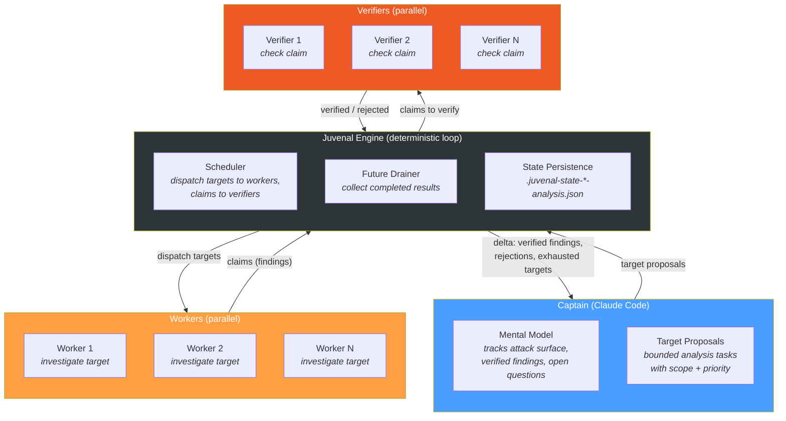
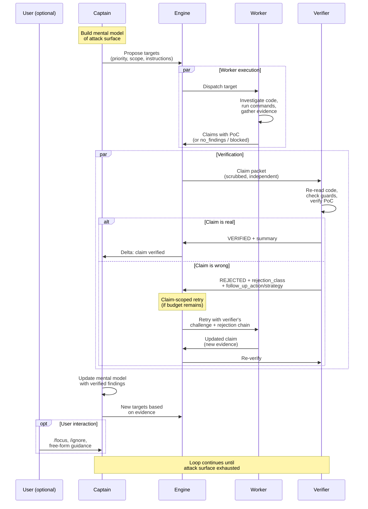
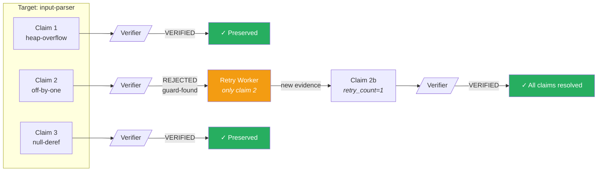
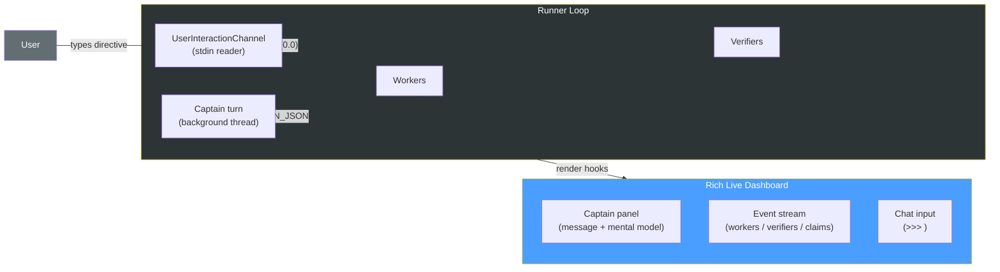
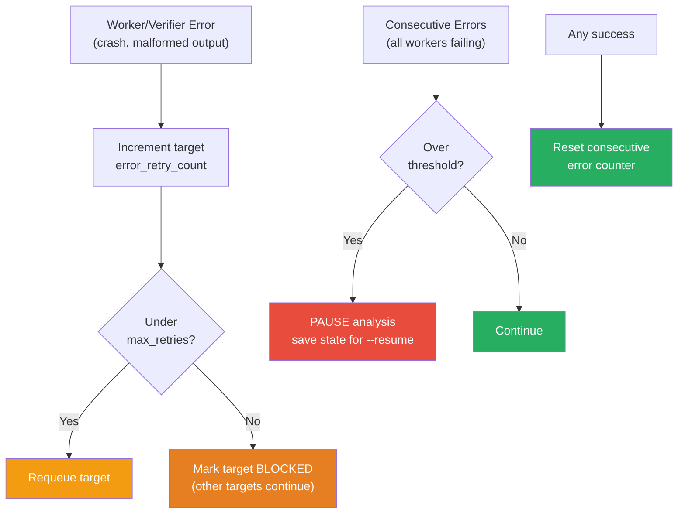

# Analysis Workflow

The analysis workflow uses a **captain/worker/verifier** architecture to perform long-running, iterative investigations with built-in verification.

## Architecture Overview

## Data Flow

## Claim-Scoped Retry (Verifier Dialog)

When a verifier rejects a claim, only that specific claim is retried — verified sibling claims are preserved.

## Interactive Mode (`--interactive`)

With `--interactive`, the runner opens a Rich Live chat dashboard. The
captain still runs as the same `claude --session-id=<uuid>` session it
uses in batch mode (resumed via `claude --resume <uuid>` per turn), but
output is rendered in the dashboard's captain panel and the user can
inject directives at any moment via the chat input.

Directives the user can type at any moment:
`/focus <text>`, `/ignore path:<prefix>`, `/ignore symbol:<name>`,
`/target <text>`, `/ask <question>`, `/now` (force the next captain
turn now), `/show captain` (print the full captain mental model
out-of-band), `/summary`, `/stop`, `/wrap`, or any free-form note.

## Error Handling

